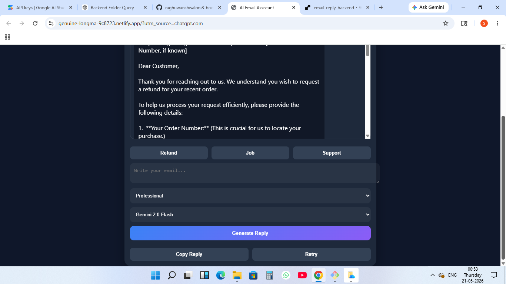
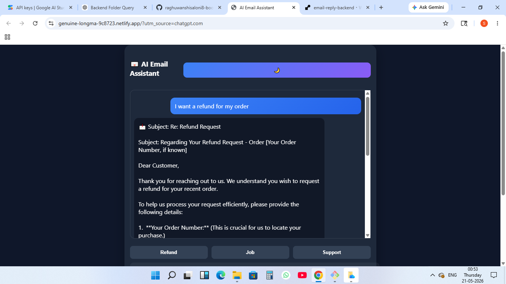
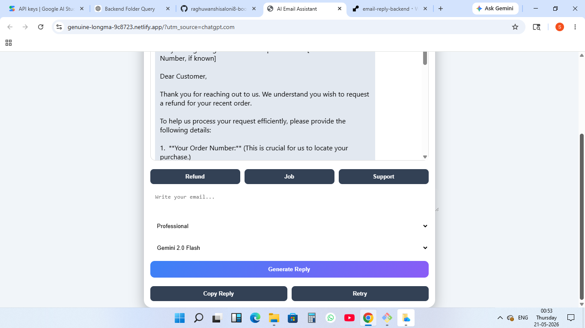

# 📧 AI Email Assistant

AI Email Assistant is a web-based project that generates smart and professional email replies using AI.

---

## 🚀 Features

- AI-powered email reply generation
- Multiple tones (formal, casual, professional)
- Simple and clean user interface
- Fast response generation
- Copy to clipboard option

---

## 🧩 Project Structure

This repository contains only the frontend:

AI-Email-Assistant/
└── index.html

Backend is maintained separately:
email-reply-backend

---

## 🔗 Live Demo (Frontend)

https://genuine-longma-9c8723.netlify.app/

---

## 🔗 Backend API

https://email-reply-backend-anc4.onrender.com/generate

---

## 📸 Screenshot

---

## 🔗 Backend Integration

fetch("https://email-reply-backend-anc4.onrender.com/generate", {
  method: "POST",
  headers: {
    "Content-Type": "application/json"
  },
  body: JSON.stringify({
    email: emailText
  })
})
.then(res => res.json())
.then(data => {
  console.log(data);
});

---

## 🛠️ Tech Stack

- HTML
- JavaScript
- AI API
- Node.js (backend separate repo)

---

## 🌐 Deployment

Frontend: Netlify  
Backend: Render

---

## 👩‍💻 Author

Saloni Raghuwanshi

---

## 📌 Note

Backend is hosted separately. 
